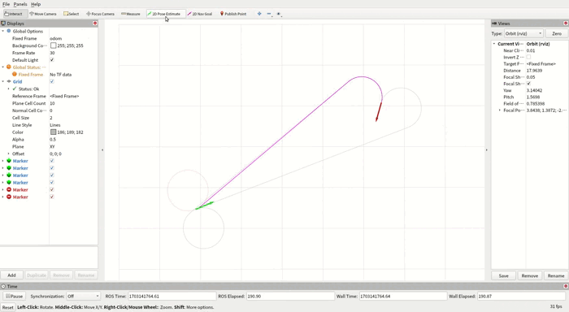

# dubins_curve

​	已经有ROS的话，直接clone下来Cmake后运行即可：

```g
git clone https://github.com/Raiden49/dubins_curve.git
```

```
cd dubins_curve
cmake -B ./build 
cmake --build ./build
source ./build/devel/setup.bash
roslaunch dubins_curve dubins_curve.launch
```
做这张图的时候，起点的绘制颜色与终点的绘制颜色好像给反了，懒得改了，凑活一下

